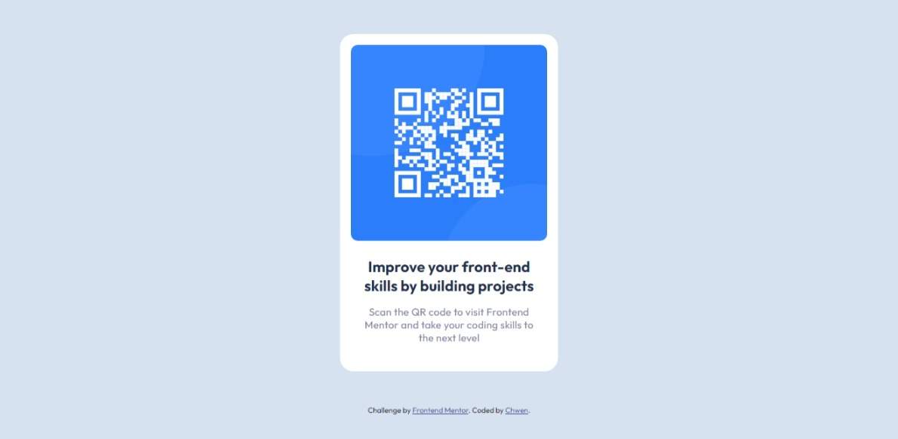

# Frontend Mentor - QR code component solution

This is a solution to the [QR code component challenge on Frontend Mentor](https://www.frontendmentor.io/challenges/qr-code-component-iux_sIO_H). Frontend Mentor challenges help you improve your coding skills by building realistic projects. 

## Table of contents

- [Overview](#overview)
  - [Screenshot](#screenshot)
  - [Links](#links)
- [My process](#my-process)
  - [Built with](#built-with)
  - [Useful resources](#useful-resources)
- [Author](#author)

## Overview

### Screenshot

### Links

- Solution URL: [https://github.com/chwenoo/qr-code-component]
- Live Site URL: [https://chwenoo.github.io/qr-code-component/]

## My process

### Built with

- Semantic HTML5 markup
- CSS custom properties
- Desktop-first workflow

### Useful resources

- [Example resource](https://www.w3schools.com)

## Author

- Frontend Mentor - [@chwenoo](https://www.frontendmentor.io/profile/chwenoo)

